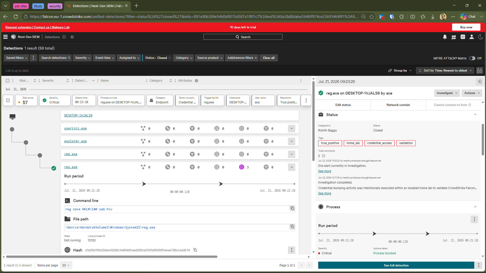
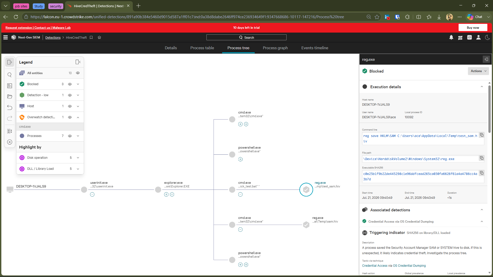
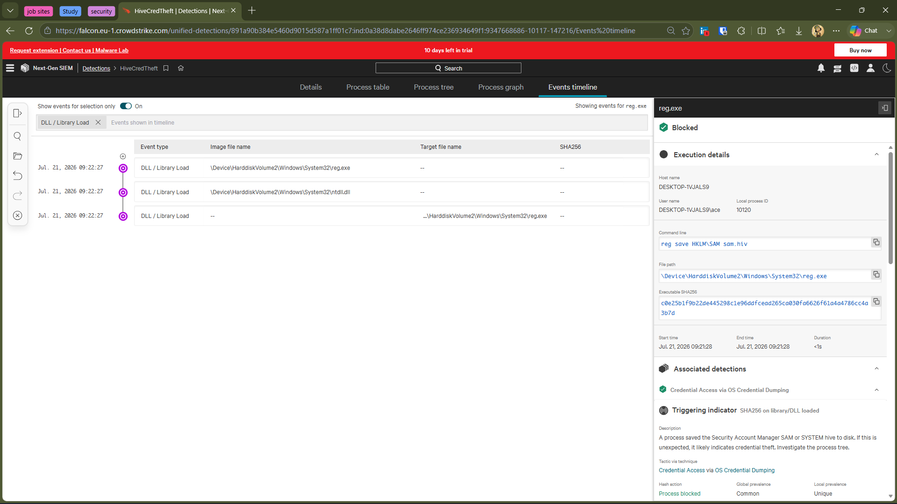

# 🚨 Investigation 01 — Credential Access Detection During SAM Hive Export Validation

---

# 📋 Alert Summary

| Field | Value |
|--------|-------|
| Detection | Credential Access via OS Credential Dumping |
| Security Product | CrowdStrike Falcon |
| Severity | 🔴 Critical |
| Risk Score | 57 |
| Status | ✅ Closed |
| Host | DESKTOP-1VJALS9 |
| User | DESKTOP-1VJALS9\ace |
| Detection Time | 21 Jul 2026 - 09:23:28 |
| MITRE ATT&CK | T1003 - OS Credential Dumping |
| Action Taken | Process Blocked |

---

# 📝 Investigation Summary

CrowdStrike Falcon generated a **Critical Credential Access** alert after detecting an attempt to export the Windows Security Account Manager (SAM) hive using **reg.exe**.

The activity originated from a user-created executable designed to validate CrowdStrike Falcon's behavioral detection capabilities inside an isolated home lab.

Falcon successfully blocked the process before the credential dumping operation could complete.

---

# 🔍 Process Analysis

### Parent Process

```
userinit.exe
      ↓
 explorer.exe
      ↓
 cmd.exe
      ↓
 reg.exe
```

### Executed Command

```cmd
reg save HKLM\SAM sam.hiv
```

### Observations

- Process initiated by the local lab user.
- reg.exe attempted to export the Windows SAM database.
- Falcon immediately detected the behavior.
- Process execution was blocked.

---

# 🛡️ Detection Analysis

CrowdStrike identified behavior consistent with an attempt to dump credentials by exporting the Windows Security Account Manager (SAM) hive.

Rather than relying solely on file signatures, Falcon recognized the command behavior associated with credential dumping and prevented the action.

---

# 🎯 MITRE ATT&CK Mapping

| Technique | ID |
|------------|----|
| OS Credential Dumping | T1003 |

---

# 📊 Impact Assessment

| Item | Result |
|------|--------|
| Credential Theft | ❌ Prevented |
| Persistence | ❌ Not Observed |
| Privilege Escalation | ❌ Not Observed |
| Lateral Movement | ❌ Not Observed |
| Malware Execution | ❌ Not Observed |

---

# 🔎 Root Cause

The activity was intentionally generated inside an isolated home lab to validate CrowdStrike Falcon's behavioral detection capabilities.

---

# ✅ Incident Classification

**Benign True Positive**

### Reason

The behavior accurately matched a real credential dumping technique (MITRE ATT&CK T1003). However, the activity was intentionally executed for security validation within a controlled lab environment. Falcon correctly detected and blocked the action.

---

# 📚 Lessons Learned

- Behavioral detections can identify credential dumping even when launched from a custom executable.
- Process ancestry provides valuable investigation context.
- Exporting the Windows SAM hive immediately triggers Credential Access detection.
- MITRE ATT&CK mapping simplifies incident classification and reporting.
- Falcon successfully prevented credential dumping before completion.

---

# 📸 Investigation Evidence

## Detection Overview



---

## Process Tree



---

## Event Timeline



---

# 🎓 Skills Demonstrated

- CrowdStrike Falcon Investigation
- Endpoint Detection & Response (EDR)
- Process Tree Analysis
- Event Timeline Analysis
- Credential Access Investigation
- MITRE ATT&CK Mapping
- Incident Documentation
- Root Cause Analysis
