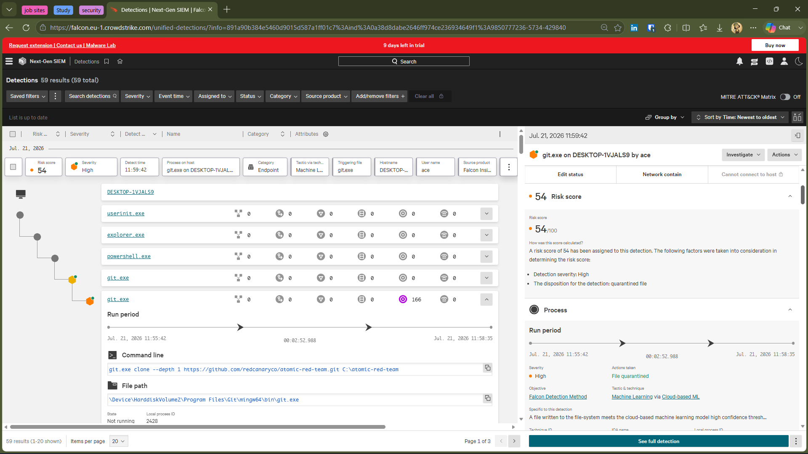
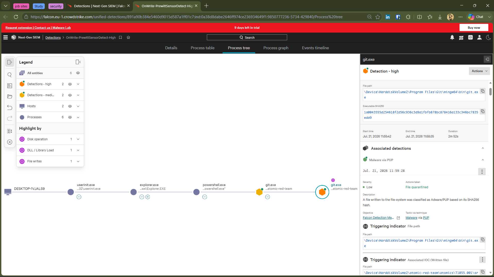
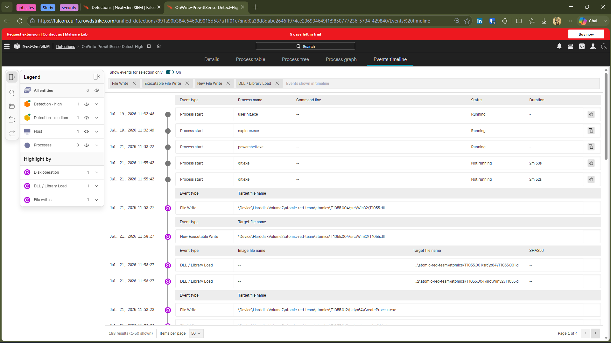
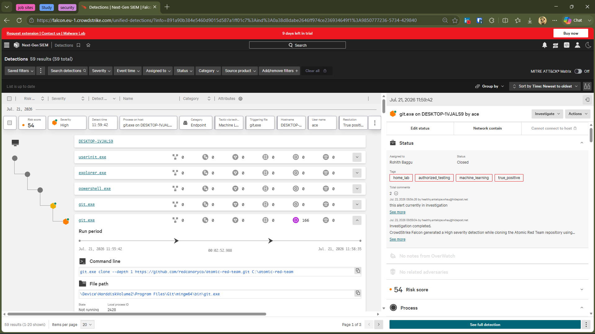

# 🚨 Investigation 02 — Atomic Red Team Git Clone Detection


---
# 📋 Alert Summary

| Field | Value |
|--------|-------|
| Detection | Malware via PUP |
| Security Product | CrowdStrike Falcon |
| Severity | 🟠 High |
| Risk Score | 54 |
| Status | ✅ Closed |
| Host | DESKTOP-1VJALS9 |
| User | DESKTOP-1VJALS9\ace |
| Detection Time | 21 Jul 2026 - 11:55:42 |
| Detection Technology | Machine Learning via Cloud-based ML |
| Action Taken | File Quarantined |

---

# 📝 Investigation Summary

CrowdStrike Falcon generated a **High** severity detection while cloning the **Atomic Red Team** repository using **git.exe**. During the repository download, Falcon identified multiple security testing artifacts as **Potentially Unwanted Programs (PUPs)** through its **Cloud-based Machine Learning** engine and automatically quarantined the detected files.

The activity was intentionally performed inside an isolated home lab as part of authorized security testing to validate CrowdStrike Falcon's detection capabilities.

---

# 🔍 Process Analysis

### Process Chain

```text
userinit.exe
      ↓
explorer.exe
      ↓
powershell.exe
      ↓
git.exe
      ↓
Atomic Red Team Repository
      ↓
Cloud ML Detection
      ↓
File Quarantine
```

### Executed Command

```powershell
git clone --depth 1 https://github.com/redcanaryco/atomic-red-team.git C:\atomic-red-team
```

### Key Observations

- Repository cloned successfully.
- Git executable itself was not blocked.
- Falcon detected files written during the clone operation.
- Twenty-two files were quarantined automatically.
- No malicious execution occurred.

---

# 🛡️ Detection Analysis

CrowdStrike Falcon detected newly written files inside the Atomic Red Team repository during the Git clone operation. The detection was generated by Falcon's **Cloud-based Machine Learning** engine, which classified several downloaded security testing binaries as **Potentially Unwanted Programs (PUPs)**.

The detection occurred while files were being written to disk and not because the Atomic Red Team tests were executed.

---

# 🎯 Detection Technology

| Category | Result |
|----------|--------|
| Primary Detection | Machine Learning via Cloud-based ML |
| Detection Classification | Malware via PUP |
| Behavioral Detection | No |
| IOC Match | No |

---

# 🎯 MITRE ATT&CK

**Not Applicable**

### Reason

The downloaded repository contains security testing artifacts mapped to multiple MITRE ATT&CK techniques. However, no ATT&CK technique was executed during this investigation. The detection occurred during the repository download rather than execution of Atomic Red Team tests.

---

# 📊 Impact Assessment

| Item | Result |
|------|--------|
| Repository Download | ✅ Completed |
| Files Quarantined | ✅ Yes |
| Malware Executed | ❌ No |
| Persistence | ❌ Not Observed |
| Privilege Escalation | ❌ Not Observed |
| Credential Theft | ❌ Not Observed |
| Lateral Movement | ❌ Not Observed |

---

# 🔎 Root Cause

The Atomic Red Team repository contains offensive security tools and simulation binaries commonly used for adversary emulation. During the Git clone operation, Falcon's Cloud-based Machine Learning engine classified several downloaded files as Potentially Unwanted Programs and quarantined them.

The repository was intentionally downloaded inside an isolated home lab for authorized security testing.

---

# ✅ Incident Classification

## Benign True Positive

### Reason

CrowdStrike Falcon correctly detected and quarantined security testing binaries contained within the Atomic Red Team repository. The activity was intentional, authorized, and performed in an isolated home lab for validation of Falcon's detection capabilities. No malicious activity was observed.

---

# 📚 Lessons Learned

- Cloud-based Machine Learning can detect offensive security tools during download.
- Git itself was not identified as malicious.
- Falcon quarantined individual files rather than blocking the repository clone.
- Process tree analysis clearly identifies the execution chain.
- Security testing repositories may trigger EDR detections before any simulation is executed.

---

# 📸 Investigation Evidence

## Detection Overview



---

## Process Tree



---

## Event Timeline



---

## Closed Alert



---

# 🎓 Skills Demonstrated

- CrowdStrike Falcon Investigation
- Endpoint Detection & Response (EDR)
- Cloud-based Machine Learning Analysis
- Process Tree Analysis
- Event Timeline Analysis
- Incident Triage
- Root Cause Analysis
- Incident Documentation
