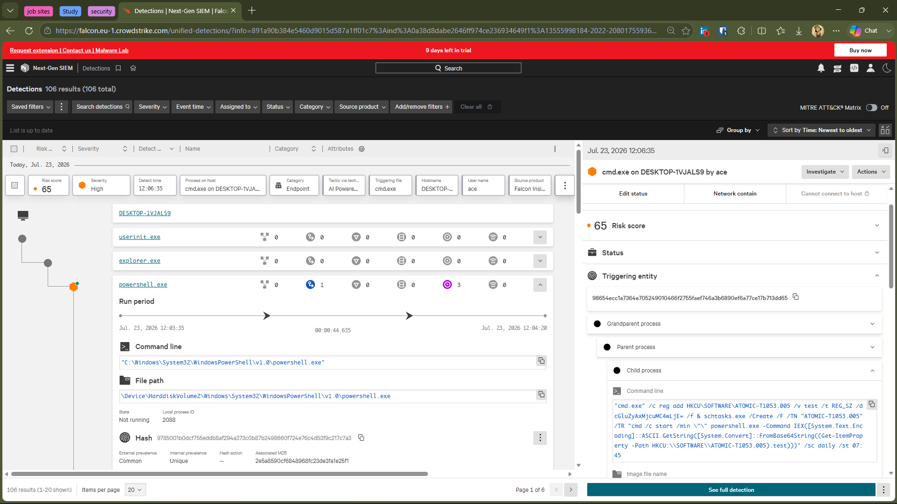
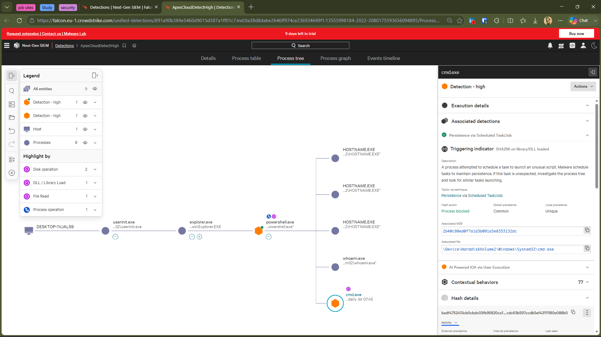
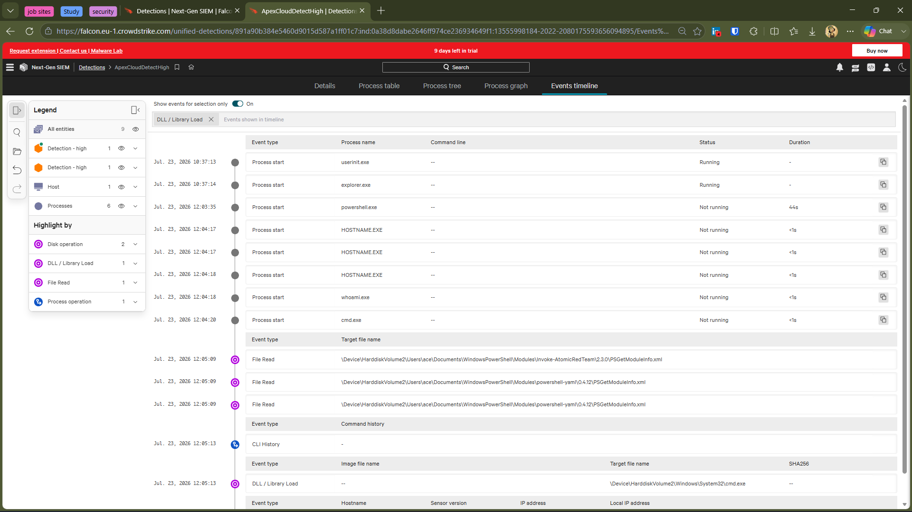
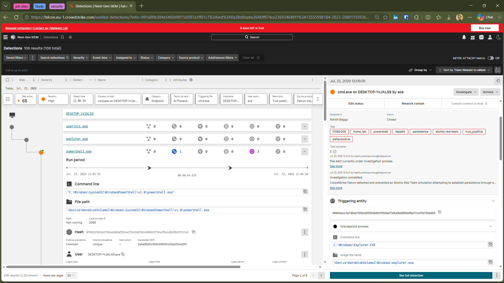

# 🚨 Investigation 03 — Scheduled Task Persistence Detection

---

# 📋 Alert Summary

| Field | Value |
|--------|-------|
| Detection | Scheduled Task Persistence |
| Security Product | CrowdStrike Falcon |
| Severity | 🟠 High |
| Risk Score | 65 |
| Status | ✅ Closed |
| Resolution | Benign True Positive |
| Host | DESKTOP-1VJALS9 |
| User | ace |
| Detection Time | 23 Jul 2026 |
| Detection Technology | AI-Powered Behavioral Detection |
| Action Taken | Process Blocked |

---

# 📝 Investigation Summary

CrowdStrike Falcon detected and prevented an Atomic Red Team simulation attempting to establish persistence through a Windows Scheduled Task. The attack leveraged registry modification, Base64-encoded PowerShell, and scheduled task creation techniques commonly associated with modern malware.

Falcon's AI-powered behavioral engine immediately blocked the malicious execution before persistence could be established. The activity was intentionally performed inside an isolated home SOC lab to validate CrowdStrike Falcon's detection and prevention capabilities.

---

# 🔍 Process Analysis

## Process Chain

```
userinit.exe
      │
explorer.exe
      │
powershell.exe
      │
cmd.exe
      │
schtasks.exe
      │
Registry Modification
      │
Scheduled Task Creation
      │
🛡️ CrowdStrike Falcon
      │
❌ Process Blocked
```

## Key Observations

- PowerShell launched the Atomic Red Team simulation.
- Registry values were created for persistence.
- A Scheduled Task creation attempt was observed.
- Base64-encoded PowerShell was used.
- Falcon immediately terminated the malicious process.
- Persistence was successfully prevented.

---

# 🎯 Detection Analysis

CrowdStrike Falcon identified behavior consistent with Scheduled Task persistence using encoded PowerShell commands.

The detection correlated multiple suspicious behaviors including:

- Scheduled Task creation
- Registry modification
- Base64 encoded PowerShell
- AI behavioral detection
- Process prevention

Falcon automatically blocked execution before the scheduled task could be successfully established.

---

# 🛡️ Detection Technology

| Category | Result |
|-----------|--------|
| Primary Detection | AI Behavioral Detection |
| Prevention | ✅ Yes |
| Process Blocked | ✅ Yes |
| Registry Monitoring | ✅ Yes |
| Scheduled Task Detection | ✅ Yes |

---

# 🎯 MITRE ATT&CK

| Technique | ID |
|-----------|----|
| Scheduled Task/Job | T1053.005 |
| Command and Scripting Interpreter: PowerShell | T1059.001 |

---

# 📊 Impact Assessment

| Item | Result |
|------|--------|
| Scheduled Task Created | ❌ Blocked |
| Registry Modification | ✅ Attempted |
| Encoded PowerShell | ✅ Detected |
| Persistence Established | ❌ Prevented |
| Malware Execution | ❌ No |
| Credential Theft | ❌ No |
| Lateral Movement | ❌ No |

---

# 🔎 Root Cause

The activity originated from an Atomic Red Team simulation executed within an isolated Windows home lab to validate CrowdStrike Falcon's behavioral detection and prevention capabilities.

Falcon identified persistence behavior involving Scheduled Tasks, registry modification, and Base64-encoded PowerShell, then immediately terminated the malicious process before persistence could be established.

---

# ✅ Incident Classification

## Benign True Positive

### Reason

The activity was intentionally executed as part of an authorized security validation exercise using Atomic Red Team.

CrowdStrike Falcon successfully detected and prevented the persistence attempt. No unauthorized compromise or malicious activity occurred outside the controlled testing environment.

---

# 📚 Lessons Learned

- Falcon effectively detects Scheduled Task persistence attempts.
- AI behavioral analysis successfully identified encoded PowerShell activity.
- Registry-based persistence attempts are closely monitored.
- Process tree analysis provides valuable attack context.
- Falcon prevented persistence before execution completed.
- Atomic Red Team is highly effective for validating EDR detections.

---

# 🎥 Prevention Demonstration

**Falcon-Blocked-Execution.mp4**

This recording demonstrates CrowdStrike Falcon immediately terminating the malicious process during execution, preventing the Scheduled Task persistence attempt before it could complete.

---

# 📸 Investigation Evidence

## Detection Overview



---

## Process Tree



---

## Events Timeline



---

## Closed Alert



---

## Falcon Prevention Demonstration

**Video:** `falcon-blocked-execution.mp4`

---

# 🛠 Skills Demonstrated

- CrowdStrike Falcon Investigation
- Endpoint Detection & Response (EDR)
- Incident Triage
- AI Behavioral Detection
- Process Tree Analysis
- Event Timeline Analysis
- Registry Analysis
- Scheduled Task Persistence Analysis
- MITRE ATT&CK Mapping
- Root Cause Analysis
- Incident Documentation
