# 🚨 Investigation 04 – Living-off-the-Land Binary (LOLBin) Abuse Using MSHTA

---

## 📌 Investigation Summary

This investigation demonstrates how attackers can abuse the legitimate Microsoft HTML Application Host (**MSHTA.exe**) to execute malicious scripts while bypassing traditional security controls.

Using **Atomic Red Team (MITRE ATT&CK T1218.005 – MSHTA)**, three different execution scenarios were performed inside an isolated Windows 10 home SOC lab protected by **CrowdStrike Falcon**.

Although all three scenarios abuse the same Windows binary (**MSHTA.exe**), CrowdStrike generated different behavioral detections because each execution chain exhibited different malicious characteristics.

This investigation highlights how CrowdStrike Falcon relies on **behavioral analysis**, **AI Powered IOAs**, **process lineage**, and **command-line inspection** instead of traditional signature-based detection.

---
## 📑 Table of Contents

- Lab Environment
- Investigation Objectives
- Investigation Workflow
- Why Three Different Alerts?
- Atomic Technique vs CrowdStrike Detection
- Scenario 1 – VBScript Execution
- Scenario 2 – HTA Execution
- Scenario 3 – PowerShell Execution
- Detection Comparison
- MITRE ATT&CK Mapping
- Key Findings
- Incident Classification
- Skills Demonstrated
- Lessons Learned
- Conclusion

---

# 🧪 Lab Environment

| Component | Value |
|------------|--------|
| Operating System | Windows 10 |
| Endpoint Protection | CrowdStrike Falcon |
| Testing Framework | Atomic Red Team |
| LOLBin | MSHTA.exe |
| Shell | Windows PowerShell |
| ATT&CK Technique Executed | T1218.005 – MSHTA |
| Investigation Type | Home SOC Lab |

---

# 🎯 Investigation Objectives

- Simulate Living-off-the-Land Binary (LOLBin) abuse using MSHTA
- Execute multiple Atomic Red Team attack scenarios
- Observe CrowdStrike Falcon behavioral detections
- Investigate AI Powered IOAs
- Analyze Process Trees
- Analyze Event Timelines
- Compare different Falcon detections generated from the same LOLBin
- Map findings to MITRE ATT&CK
- Produce SOC-style investigation documentation

---

# 🔍 Investigation Workflow

```

Atomic Red Team Execution
│
▼
CrowdStrike Falcon Detection
│
▼
SOC Alert Review
│
▼
Process Tree Analysis
│
▼
Behavior Analysis
│
▼
MITRE ATT&CK Mapping
│
▼
Impact Assessment
│
▼
Incident Classification
│
▼
Case Closed

```

---

# ⚙️ Why Were Three Different Alerts Generated?

Although every scenario abused the same Microsoft binary (**MSHTA.exe**), CrowdStrike Falcon generated different detections because each execution method demonstrated different behavioral characteristics.

### Scenario 1 – Embedded VBScript

The embedded VBScript executed through MSHTA produced suspicious command execution and script interpreter activity.

Falcon classified this behavior as:

- Execution via Command and Scripting Interpreter
- MITRE T1059

---

### Scenario 2 – HTA Execution

Executing a malicious HTA file produced exploit-like behavior together with defense evasion indicators.

Falcon classified this behavior as:

- Defense Evasion via Exploitation for Defense Evasion
- MITRE T1211

---

### Scenario 3 – PowerShell Execution

MSHTA launched PowerShell directly using suspicious command-line arguments.

Falcon classified this activity as:

- Execution via User Execution

Unlike the previous two detections, Falcon treated this primarily as suspicious user-driven execution instead of mapping it to another MITRE technique.

---

# 🧩 Atomic Technique vs CrowdStrike Detection

This investigation demonstrates an important distinction.

**Atomic Red Team executed:**

- **T1218.005 – MSHTA**

However, CrowdStrike Falcon generated behavioral detections based on the observed execution chain rather than simply reporting the Atomic ATT&CK technique.

| Scenario | Atomic Technique | Falcon Behavioral Detection |
|-----------|-----------------|-----------------------------|
| Scenario 1 | T1218.005 – MSHTA | T1059 – Command and Scripting Interpreter |
| Scenario 2 | T1218.005 – MSHTA | T1211 – Exploitation for Defense Evasion |
| Scenario 3 | T1218.005 – MSHTA | Execution via User Execution |

This demonstrates CrowdStrike's behavioral detection capabilities and shows how Falcon correlates process relationships, command-line activity, and runtime behavior to classify suspicious activity.

---

# ⚔️ Scenario 1 – Embedded VBScript Execution

## Alert Summary

| Field | Value |
|------|------|
| Detection Name | Execution via Command and Scripting Interpreter |
| Technique ID | T1059 |
| Risk Score | **80 / 100** |
| Severity | High |
| Falcon Action | Process Killed |
| Objective | Follow Through |
| IOA Name | ObfCmdToUnusualScript |

---

## Detection Description

CrowdStrike detected an obfuscated command attempting to launch an unusual script through **MSHTA.exe**.

Behavioral analysis identified suspicious command interpreter activity consistent with script-based attack techniques.

The process was immediately terminated before execution could continue.

---

## Risk Assessment

**Risk Score:** **80 / 100**

Falcon assigned a high risk score because the execution exhibited:

- Obfuscated command-line activity
- Suspicious scripting behavior
- Command interpreter abuse
- High-confidence behavioral indicators

---

## Investigation Outcome

CrowdStrike Falcon successfully detected and interrupted the malicious activity through behavioral analysis.

The detection included:

- AI Powered IOA analysis
- Process tree correlation
- Command-line inspection
- Event timeline generation
- Parent-child process relationship analysis
- Automatic process termination

The attack was prevented before the simulated technique could complete successfully.

---

# 🖼️ Investigation Evidence

## Detection Overview

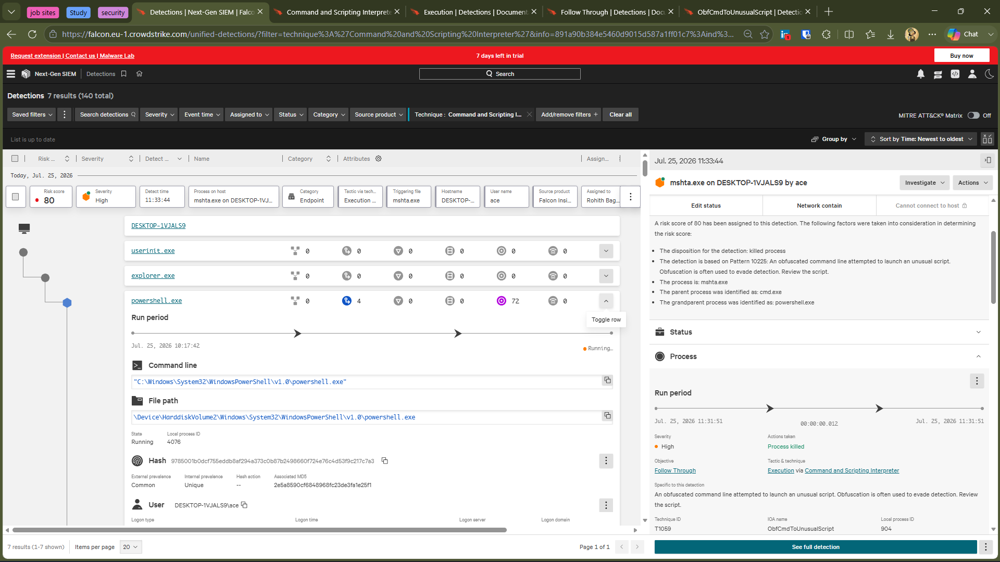

---

## Detection Details

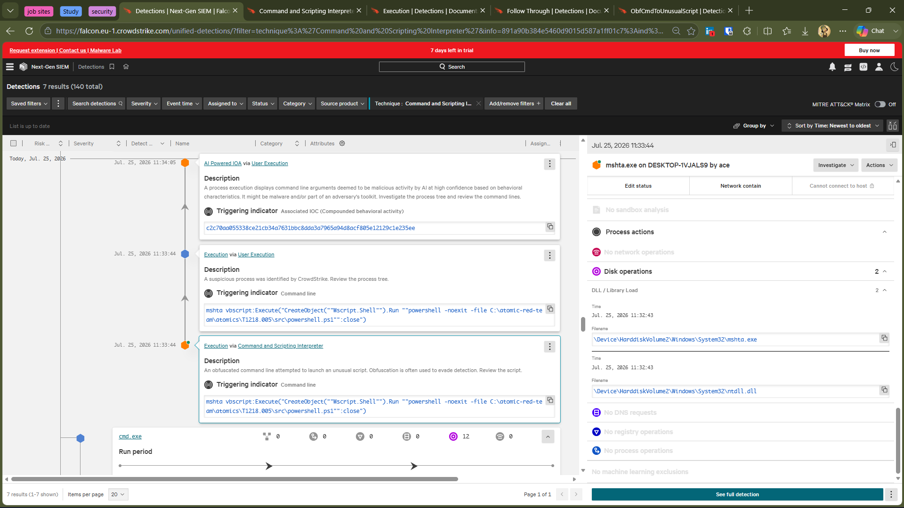

---

## Process Tree

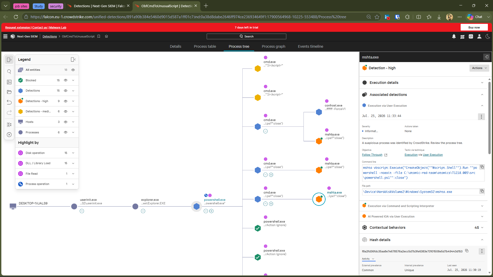

---

## Event Timeline

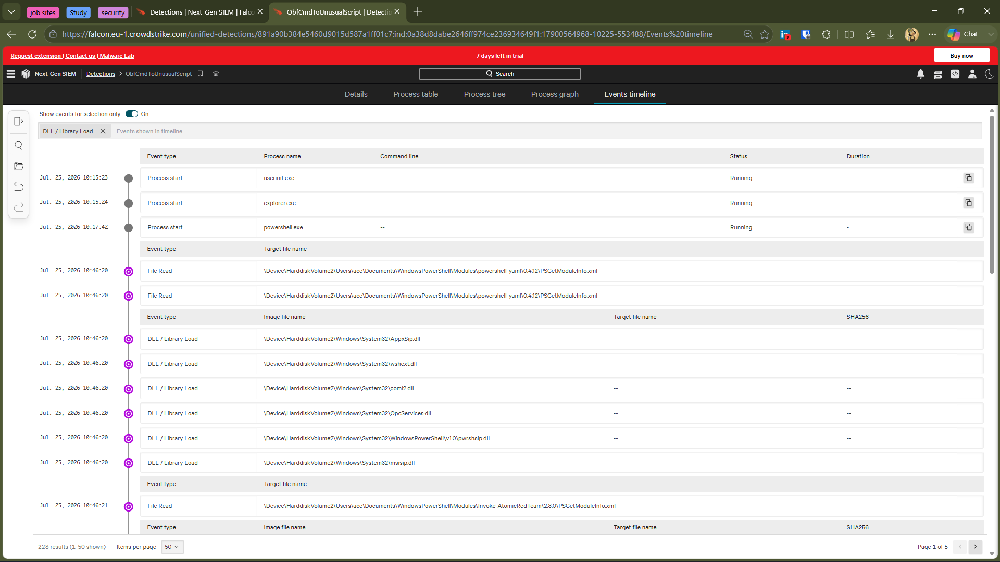

---

## Alert Closed

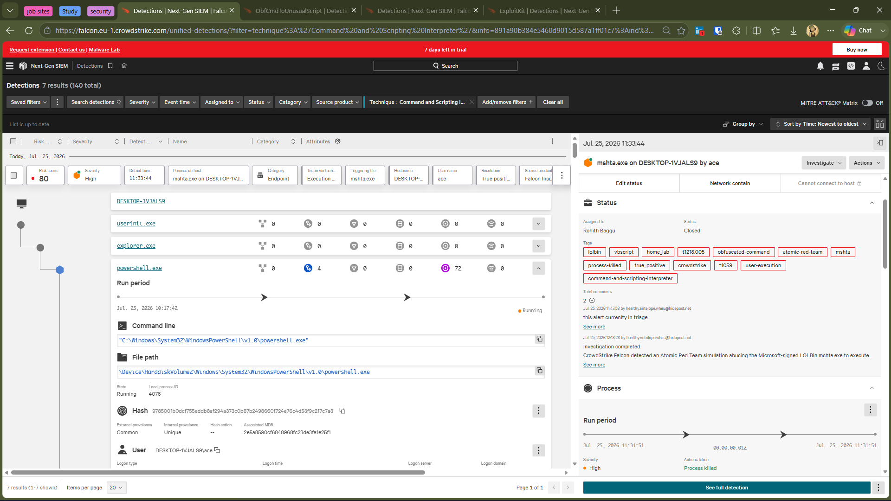

---

## 🎬 Attack Demonstration


---

# ⚔️ Scenario 2 – HTA Execution via MSHTA

## Alert Summary

| Field | Value |
|------|------|
| Detection Name | Defense Evasion via Exploitation for Defense Evasion |
| Technique ID | T1211 |
| Risk Score | **72 / 100** |
| Severity | High |
| Falcon Action | Process Blocked |
| Objective | Keep Access |
| IOA Name | ExploitKit |

---

## Detection Description

CrowdStrike Falcon detected suspicious execution of a malicious HTML Application (HTA) launched through **MSHTA.exe**.

Behavioral analysis identified exploit-kit characteristics commonly associated with defense evasion techniques. Falcon generated an **ExploitKit** behavioral detection and blocked the malicious process before execution could continue.

Unlike Scenario 1, this detection focused on exploit-style behavior rather than command interpreter activity.

---

## Risk Assessment

**Risk Score:** **72 / 100**

The elevated risk score resulted from Falcon identifying:

- Exploit-kit style execution
- Defense evasion behavior
- Suspicious HTA execution
- Malicious execution chain through MSHTA
- High-confidence behavioral indicators

---

## Investigation Outcome

CrowdStrike Falcon successfully interrupted the attack before the malicious HTA could complete execution.

Behavioral analytics identified the execution chain as suspicious and prevented the attack before additional payloads could be executed.

---

# 🖼️ Investigation Evidence

## Detection Overview

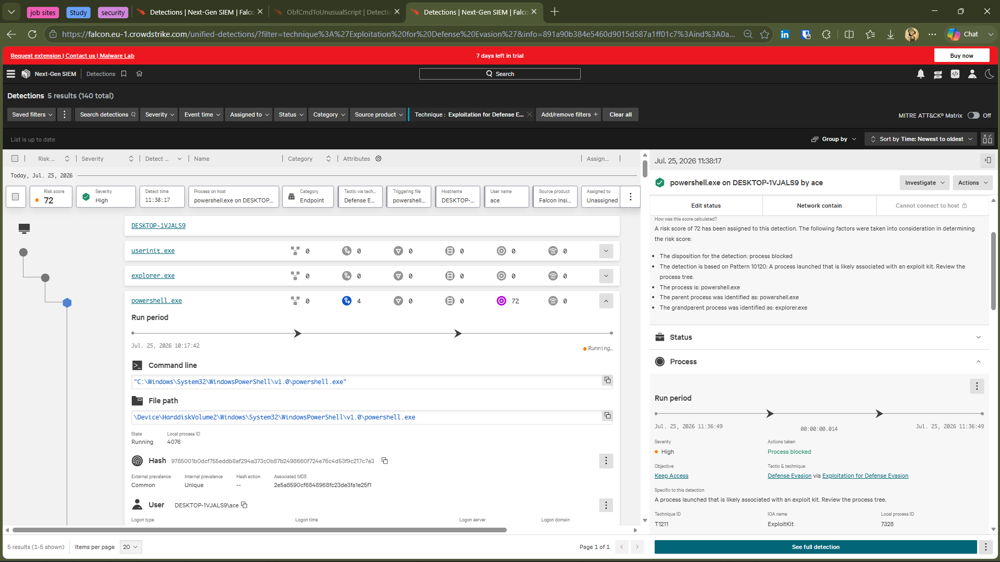

---

## Detection Details

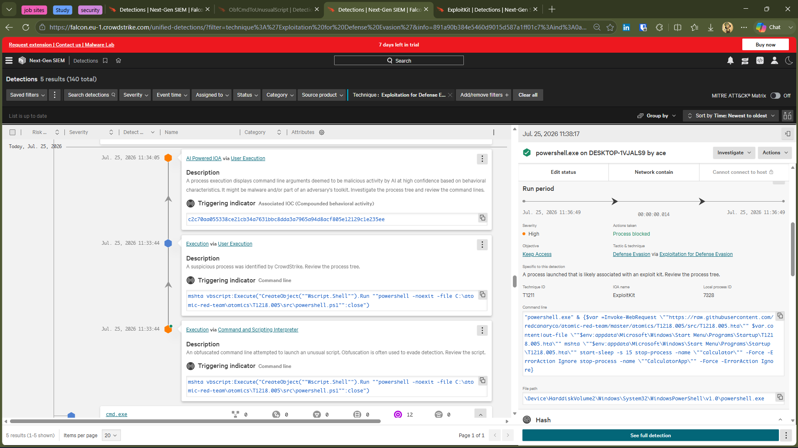

---

## Process Tree

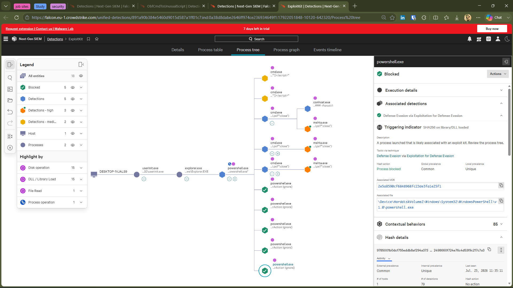

---

## Event Timeline

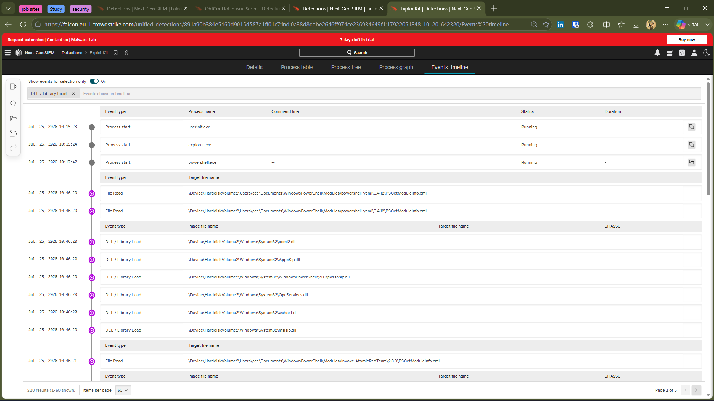

---

## Alert Closed

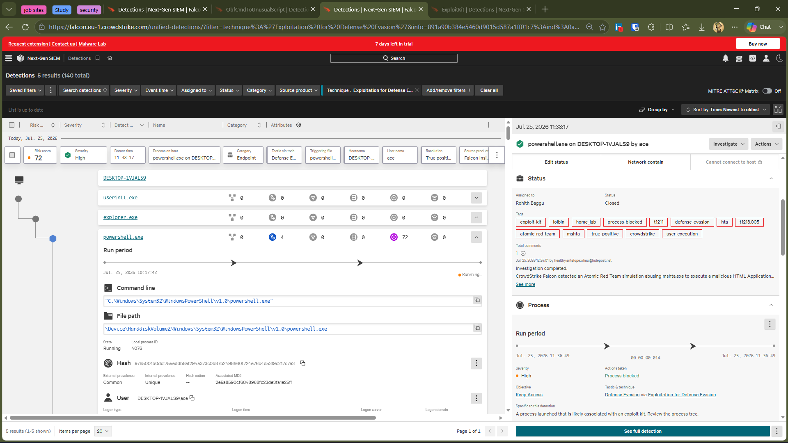

---

## 🎬 Attack Demonstration

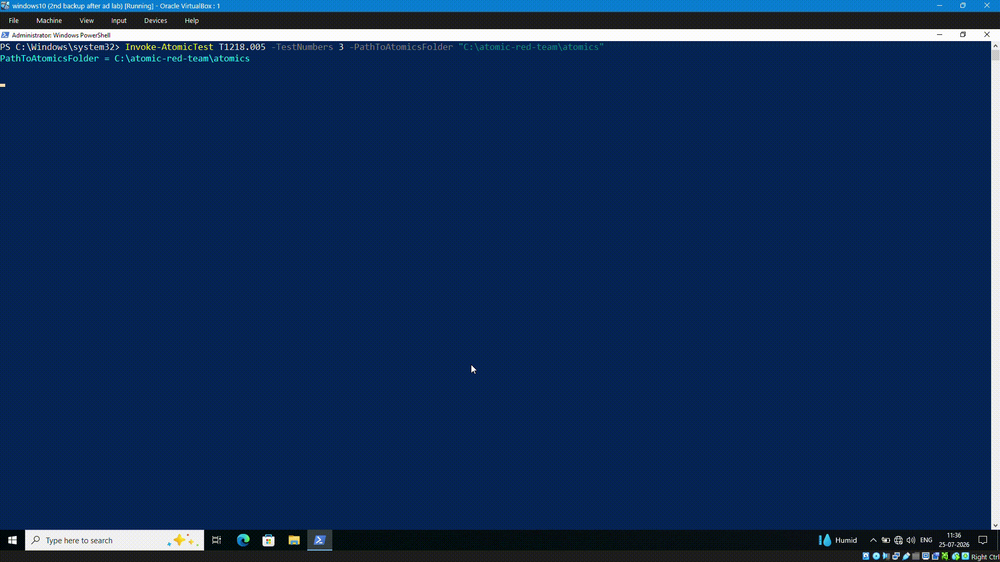)

---

# ⚔️ Scenario 3 – PowerShell Execution via MSHTA

## Alert Summary

| Field | Value |
|------|------|
| Detection Name | Execution via User Execution |
| Risk Score | **55 / 100** |
| Severity | Medium |
| Falcon Action | Process Blocked |
| AI Powered IOA | Yes |
| Detection Type | Behavioral Detection |

---

## Detection Description

CrowdStrike Falcon detected suspicious PowerShell execution initiated through **MSHTA.exe**.

Unlike the previous scenarios, Falcon classified this activity primarily as **User Execution**, indicating that the execution chain originated from user-driven activity exhibiting suspicious behavioral characteristics.

The malicious process was blocked before execution could continue.

---

## Risk Assessment

**Risk Score:** **55 / 100**

This scenario received a lower risk score because fewer malicious behavioral indicators were observed compared to the previous two scenarios.

Although suspicious, the execution chain contained fewer exploit characteristics while still matching Falcon's behavioral detection logic.

---

## Investigation Outcome

CrowdStrike Falcon successfully detected the suspicious PowerShell execution chain and blocked the process before the simulated attack could complete.

Behavioral analytics correlated the parent-child process relationship and identified suspicious command-line execution through MSHTA.

---

# 🖼️ Investigation Evidence

## Detection Overview

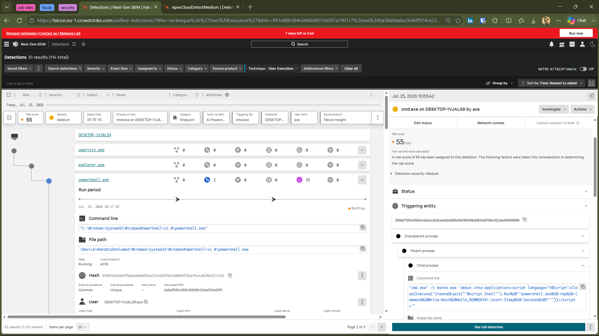

---

## Process Tree

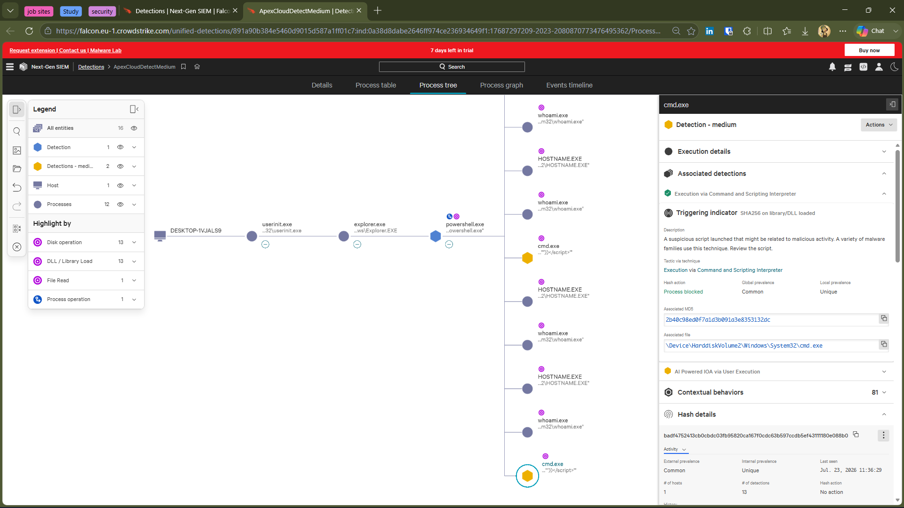

---

## Event Timeline

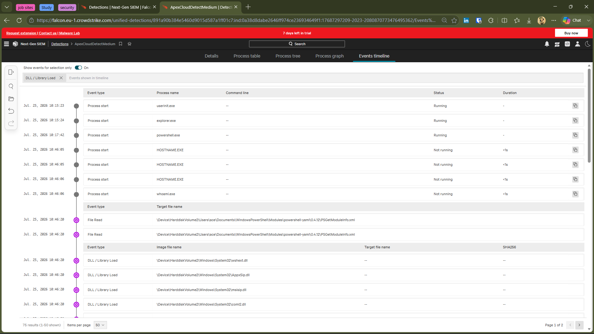

---

## Alert Closed

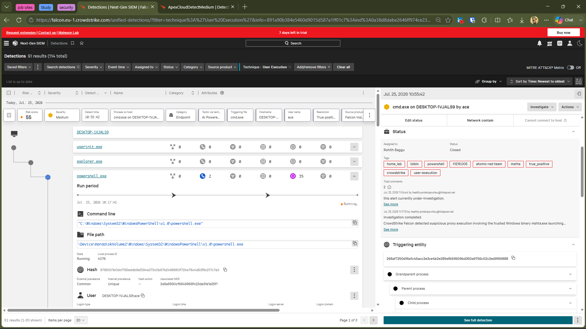

---

## 🎬 Attack Demonstration

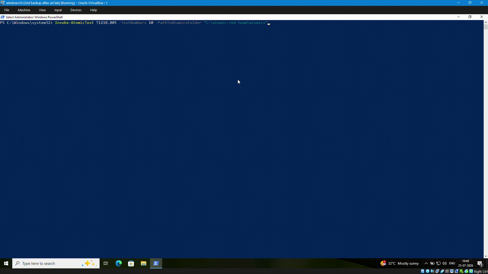

---

# 📊 Detection Comparison

| Scenario | Detection Name | MITRE Technique | Risk Score | Severity | Falcon Action |
|----------|----------------|----------------|-----------:|----------|---------------|
| Scenario 1 | Execution via Command and Scripting Interpreter | T1059 | 80 | High | Process Killed |
| Scenario 2 | Defense Evasion via Exploitation for Defense Evasion | T1211 | 72 | High | Process Blocked |
| Scenario 3 | Execution via User Execution | Not Displayed by Falcon | 55 | Medium | Process Blocked |

---

# 🎯 MITRE ATT&CK Mapping

## Atomic Red Team Technique Executed

| Framework | Technique |
|-----------|-----------|
| MITRE ATT&CK | T1218.005 – MSHTA |

All three Atomic Red Team tests leveraged **MSHTA.exe**, a legitimate Windows binary that can be abused to execute malicious scripts and payloads while blending with normal system activity.

---

## CrowdStrike Behavioral Classification

Rather than reporting the executed Atomic technique directly, CrowdStrike Falcon classified each scenario based on its observed behavior during execution.

| Scenario | Falcon Classification |
|----------|-----------------------|
| Scenario 1 | T1059 – Command and Scripting Interpreter |
| Scenario 2 | T1211 – Exploitation for Defense Evasion |
| Scenario 3 | Execution via User Execution |

This demonstrates Falcon's behavior-based detection approach, where detections are generated from runtime activity, process relationships, and command-line behavior instead of relying solely on the executed ATT&CK technique.

---

# 🔑 Key Findings

- Successfully simulated three MSHTA abuse techniques using Atomic Red Team.
- CrowdStrike Falcon detected all three scenarios through behavioral analysis.
- The same LOLBin (**MSHTA.exe**) generated different detections based on how it was used.
- Falcon correlated parent-child process relationships and suspicious command-line activity to classify each attack.
- Process Tree and Event Timeline views provided valuable context for investigation.
- Falcon automatically blocked or terminated the malicious processes before the simulated attacks could complete.
- The investigation demonstrates the effectiveness of behavior-based detection against Living-off-the-Land Binary (LOLBin) abuse.

---

# 📝 Incident Classification

| Category | Result |
|----------|--------|
| Environment | Home SOC Lab |
| Detection Type | Behavioral Detection |
| Classification | Benign True Positive |
| Root Cause | Authorized Atomic Red Team Simulation |
| Business Impact | None |
| Containment | Automatic by CrowdStrike Falcon |
| Analyst Action | Investigated and Closed |

---

# 💼 Skills Demonstrated

- CrowdStrike Falcon Investigation
- Behavioral Detection Analysis
- Endpoint Detection and Response (EDR)
- Living-off-the-Land Binary (LOLBin) Analysis
- Process Tree Investigation
- Event Timeline Analysis
- MITRE ATT&CK Mapping
- Atomic Red Team Testing
- Incident Documentation

---

# 📚 Lessons Learned

- Legitimate Windows binaries such as **MSHTA.exe** can be abused to execute malicious code.
- The same ATT&CK technique may produce different behavioral detections depending on execution characteristics.
- Behavioral analytics provide greater visibility than traditional signature-based detection.
- Process lineage and command-line analysis are critical for understanding attack chains.
- AI-powered behavioral detections improve visibility into modern attack techniques.
- Accurate investigation requires correlating alerts with process trees, timelines, and behavioral context.

---

# ✅ Conclusion

This investigation demonstrated how **CrowdStrike Falcon** detects and prevents abuse of the legitimate Windows binary **MSHTA.exe** through behavior-based analysis.

Although all three attack simulations executed the same Atomic Red Team technique (**T1218.005 – MSHTA**), Falcon generated different detections based on the observed runtime behavior, highlighting its ability to analyze process relationships, command-line activity, and execution patterns rather than relying solely on predefined signatures.

The simulated attacks were successfully detected and blocked or terminated, providing valuable insight into Falcon's AI-powered endpoint protection capabilities and reinforcing the importance of behavioral analytics in modern endpoint security.

---
# 📝 Analyst Notes

| Field | Value |
|--------|--------|
| **Investigation Status** | Closed |
| **Classification** | Benign True Positive |
| **Environment** | Home SOC Lab |
| **Detection Platform** | CrowdStrike Falcon |
| **Investigation Method** | Atomic Red Team |
| **Analyst** | Rohith Baggu |
