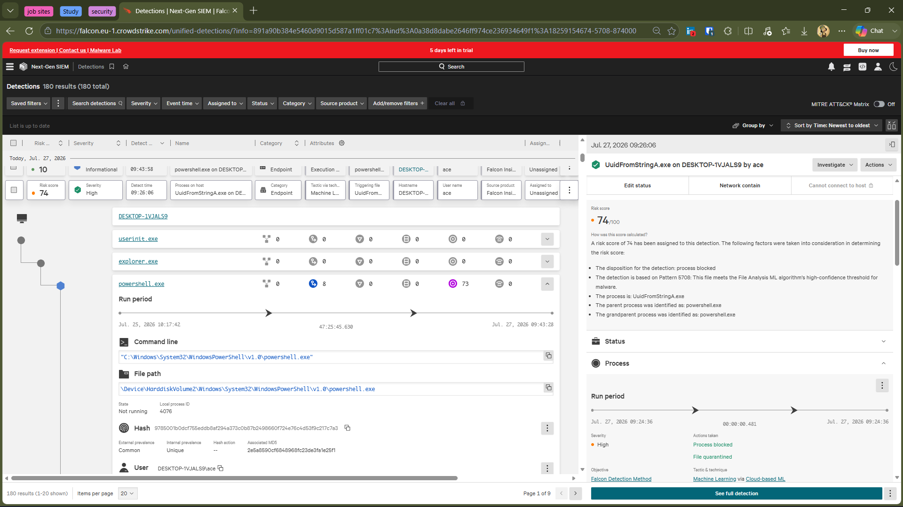
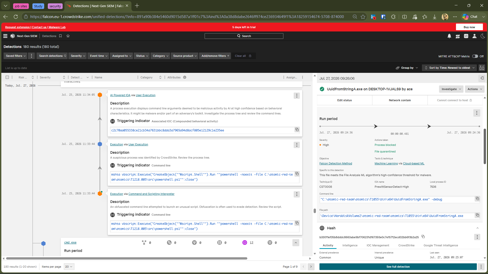
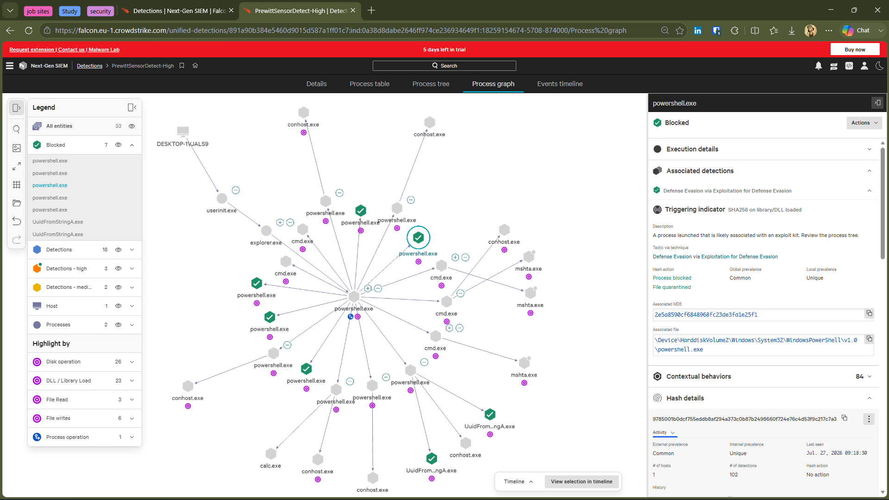
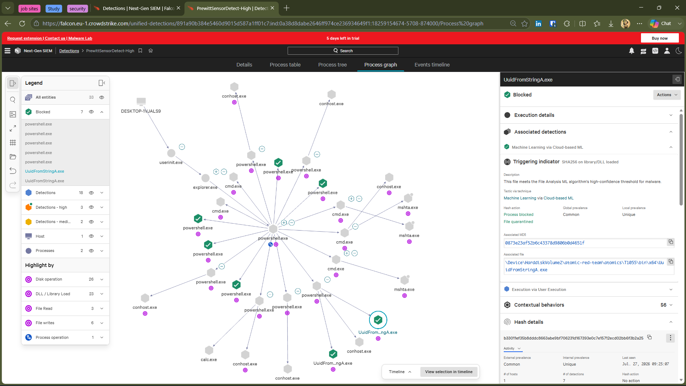
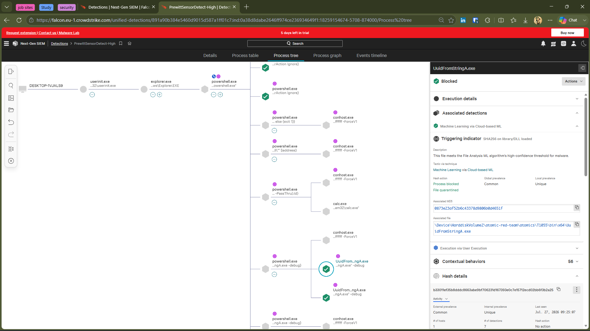
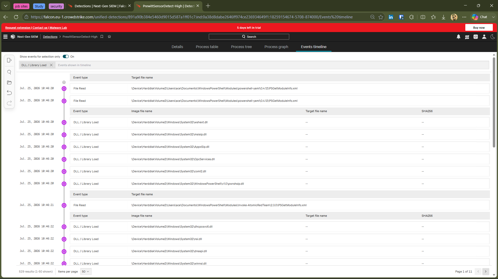
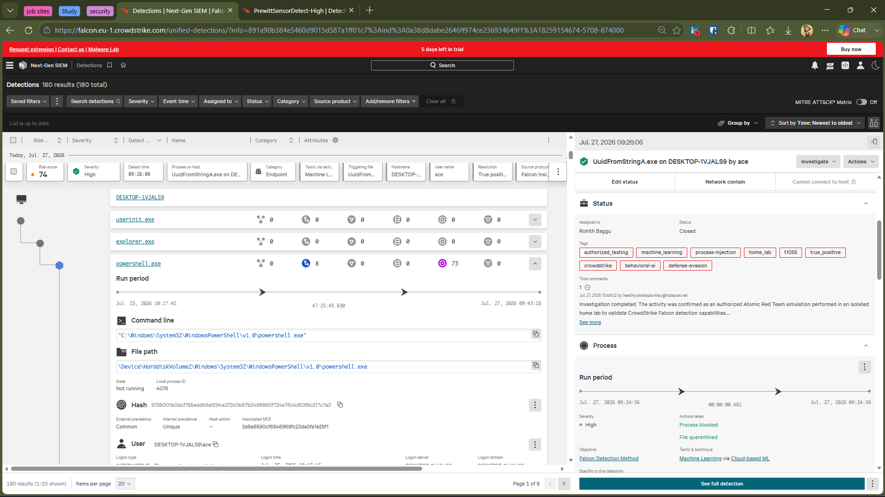
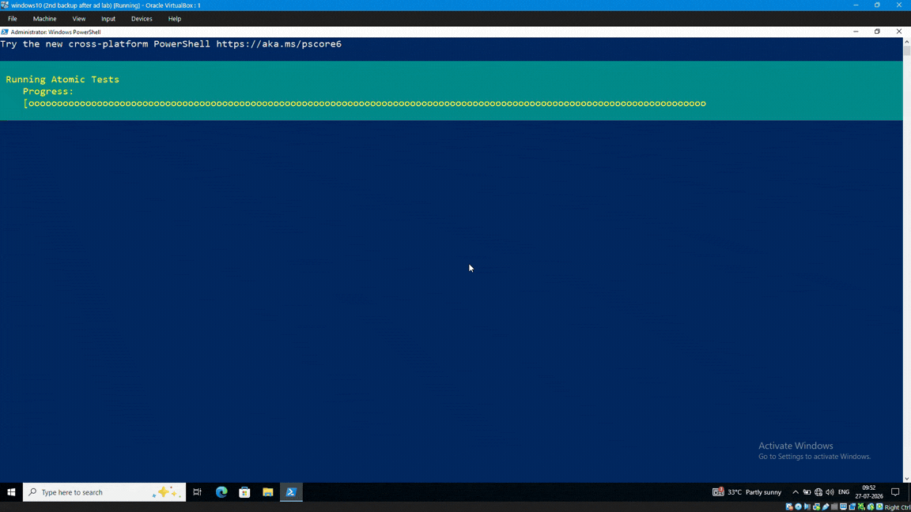

# 🛡️ Investigation 05 – Process Injection ML Detection

## 📌 Overview

This investigation demonstrates CrowdStrike Falcon's ability to detect and prevent a Process Injection attack simulated using Atomic Red Team.

The Atomic Red Team test emulated the MITRE ATT&CK Process Injection technique (T1055) using the UuidFromStringA Windows API. During execution, CrowdStrike Falcon successfully identified the malicious executable through Cloud-based Machine Learning, generated multiple correlated detections, blocked the malicious process, and quarantined the executable before successful payload execution.

This investigation highlights Falcon's layered detection capabilities by combining Machine Learning, behavioral analysis, and process monitoring to stop malicious activity before it could complete.

---

## 🎯 MITRE ATT&CK Mapping

| Category | Details |
|----------|---------|
| **Technique** | Process Injection |
| **MITRE ATT&CK ID** | T1055 |
| **Atomic Test** | T1055-6 – Process Injection with Go using UuidFromStringA WinAPI |
| **Execution Method** | Atomic Red Team |
| **Operating System** | Windows 10 |
| **Security Platform** | CrowdStrike Falcon |

---

# 🔍 Investigation Summary

## Alert Summary

| Field | Value |
|-------|-------|
| **Detection Name** | Machine Learning via Cloud-based ML |
| **Severity** | High |
| **Risk Score** | 74 |
| **Objective** | Falcon Detection Method |
| **Technique ID** | CST0008 |
| **IOA Name** | PrewittSensorDetect-High |
| **Action Taken** | Process Blocked |
| **Additional Action** | File Quarantined |
| **Host** | DESKTOP-1VJALS9 |

---

## 🧪 Attack Simulation

The following Atomic Red Team test was executed to simulate Process Injection:

```powershell
Invoke-AtomicTest T1055-6 -PathToAtomicsFolder "C:\atomic-red-team\atomics"
```

CrowdStrike Falcon immediately analyzed the executable using Cloud-based Machine Learning, blocked execution, quarantined the executable, and generated multiple correlated detections for further investigation.

---

# 🤖 Machine Learning Detection

Unlike the previous investigations that primarily relied on behavioral detections, this investigation demonstrates CrowdStrike Falcon's Machine Learning capabilities.

During execution, Falcon determined that the executable met the File Analysis Machine Learning algorithm's high-confidence threshold for malware and prevented the attack before successful payload execution.

The prevention generated additional investigation artifacts, allowing analysts to review the execution chain, command line activity, process relationships, and associated behaviors.

---

# 📋 Detection Details

## Detection Overview



This dashboard summarizes the primary detection generated during the investigation. CrowdStrike classified the executable using Cloud-based Machine Learning, assigned a High severity with a Risk Score of 74, and automatically blocked the process before payload execution.

---

## AI Detection Details



The detection details provide the underlying machine learning classification, associated IOA information, process metadata, and prevention actions. These details help analysts understand why Falcon determined the executable to be malicious.

---

## 📊 Multiple Correlated Detections

During the investigation, CrowdStrike Falcon generated multiple correlated detections from the same execution chain.

| Detection | Purpose |
|-----------|----------|
| **Machine Learning via Cloud-based ML** | Identified the executable as malicious using Falcon's Machine Learning engine. |
| **Execution via User Execution** | Detected suspicious execution initiated by the user. |
| **Defense Evasion via Exploitation for Defense Evasion** | Identified additional suspicious behavior associated with the execution chain. |

These correlated detections provide analysts with greater context during incident investigation and demonstrate Falcon's ability to combine multiple detection methods into a single investigation.

---
# 🌳 Process Analysis

## Process Graph – PowerShell Execution



This process graph illustrates the initial execution chain initiated through **PowerShell**. CrowdStrike Falcon correlated the parent-child process relationship and identified suspicious execution behavior associated with the Atomic Red Team simulation.

The graph provides analysts with a high-level visualization of the attack flow and the processes involved during execution.

---

## Process Graph – Machine Learning Detection



This process graph highlights the execution of **UuidFromStringA.exe**, which CrowdStrike Falcon identified as malicious using its Cloud-based Machine Learning engine.

Falcon automatically blocked the executable, quarantined the file, and generated multiple correlated detections to support further investigation.

---

## Process Tree



The Process Tree provides a detailed hierarchical view of the execution chain, showing how the attack progressed from the parent process to the blocked executable.

Unlike the Process Graph, which focuses on process relationships and overall attack flow, the Process Tree enables analysts to trace the complete execution path, investigate parent-child relationships, review command-line activity, and understand how CrowdStrike Falcon reconstructed the attack sequence.

---

## Event Timeline



The Event Timeline presents the attack sequence in chronological order, allowing analysts to correlate detection events, process execution, and Falcon response actions throughout the investigation.

---

## Alert Closed



After completing the investigation, the alert was reviewed and confirmed as an authorized Atomic Red Team simulation conducted within an isolated home SOC laboratory.

The activity was classified as a **Benign True Positive**, and the investigation was successfully closed.

---

## 🎬 Attack Demonstration



The demonstration below shows the execution of the Atomic Red Team Process Injection simulation and CrowdStrike Falcon's real-time prevention, resulting in automatic process blocking and file quarantine.

---

# 📝 Investigation Outcome

CrowdStrike Falcon successfully prevented the simulated Process Injection attack before payload execution could complete.

The investigation confirmed that Falcon:

- Identified the executable using Cloud-based Machine Learning.
- Generated AI-powered detections for suspicious execution.
- Correlated multiple behavioral detections.
- Blocked the malicious process.
- Quarantined the executable.
- Preserved investigation artifacts for analyst review.

No unauthorized activity occurred outside the isolated testing environment.

---

# 🔑 Key Findings

- Successfully simulated a Process Injection technique using Atomic Red Team.
- Falcon detected the executable through Cloud-based Machine Learning.
- Multiple correlated detections were generated from a single execution chain.
- The malicious process was blocked before successful execution.
- The executable was automatically quarantined.
- Process Graphs and Event Timeline provided valuable investigation context.
- Falcon combined Machine Learning and behavioral analysis to prevent the attack.

---

# 📊 Incident Classification

| Category | Result |
|-----------|--------|
| Environment | Home SOC Lab |
| Detection Type | Machine Learning + Behavioral Detection |
| Classification | Benign True Positive |
| Root Cause | Authorized Atomic Red Team Simulation |
| Business Impact | None |
| Containment | Automatic by CrowdStrike Falcon |
| Analyst Action | Investigated and Closed |

---

# 🛠️ MITRE ATT&CK Mapping

| Tactic | Technique | MITRE ID |
|--------|-----------|-----------|
| Defense Evasion | Process Injection | T1055 |
| Execution | User Execution | T1204 |
| Defense Evasion | Exploitation for Defense Evasion | T1211 |

---

# 💡 Skills Demonstrated

- CrowdStrike Falcon Investigation
- Machine Learning Detection Analysis
- Process Graph & Process Tree Analysis
- Event Timeline Correlation
- MITRE ATT&CK Mapping
- Incident Documentation

---

# 🎯 Investigation Outcome

This investigation successfully demonstrated CrowdStrike Falcon's ability to detect and prevent a simulated Process Injection attack using multiple detection technologies.

A single Atomic Red Team execution generated several correlated detections, allowing analysts to investigate the complete attack chain using Machine Learning detections, behavioral analytics, Process Graphs, Process Trees, and the Event Timeline.

CrowdStrike Falcon automatically:

- ✅ Identified the executable using Cloud-based Machine Learning
- ✅ Generated correlated behavioral detections
- ✅ Blocked the malicious process
- ✅ Quarantined the executable
- ✅ Preserved investigation artifacts for analyst review

The activity was confirmed as an authorized Atomic Red Team simulation conducted within an isolated home SOC laboratory and was classified as a **Benign True Positive**.

---

# 📚 Key Takeaways

- Modern EDR platforms combine Machine Learning with behavioral analytics to improve detection accuracy.
- A single attack can generate multiple correlated detections that provide additional investigation context.
- Process Graphs and Process Trees help analysts understand process relationships and execution flow.
- Event Timelines simplify attack reconstruction by presenting events in chronological order.
- Automatic prevention actions reduce attacker dwell time while preserving valuable forensic evidence.
- Mapping detections to the MITRE ATT&CK framework improves investigation consistency and reporting.

---

# ✅ Conclusion

This investigation demonstrates how CrowdStrike Falcon leverages Cloud-based Machine Learning and behavioral detection technologies to identify and prevent Process Injection attacks before payload execution.

By analyzing Process Graphs, Process Trees, Event Timelines, and correlated detections, analysts can efficiently reconstruct attack activity, validate prevention actions, and document findings using industry-standard investigation practices.

This investigation further strengthened practical experience in CrowdStrike Falcon, EDR investigation workflows, MITRE ATT&CK mapping, and SOC incident analysis within a controlled home lab environment.

---

# 📝 Analyst Notes

| Field | Value |
|--------|--------|
| **Investigation Status** | Closed |
| **Classification** | Benign True Positive |
| **Environment** | Home SOC Lab |
| **Detection Source** | CrowdStrike Falcon |
| **Attack Simulation** | Atomic Red Team |
| **Analyst** | Rohith Baggu |
