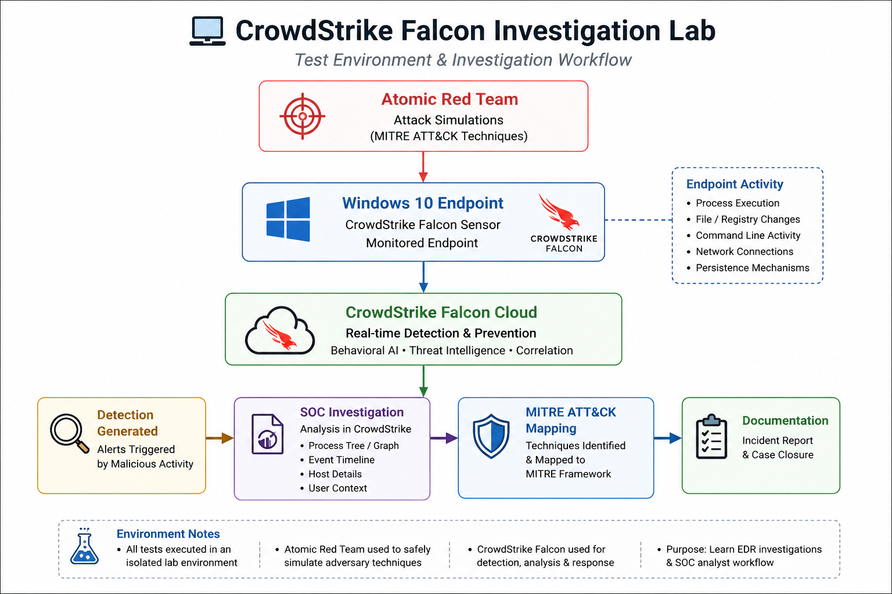
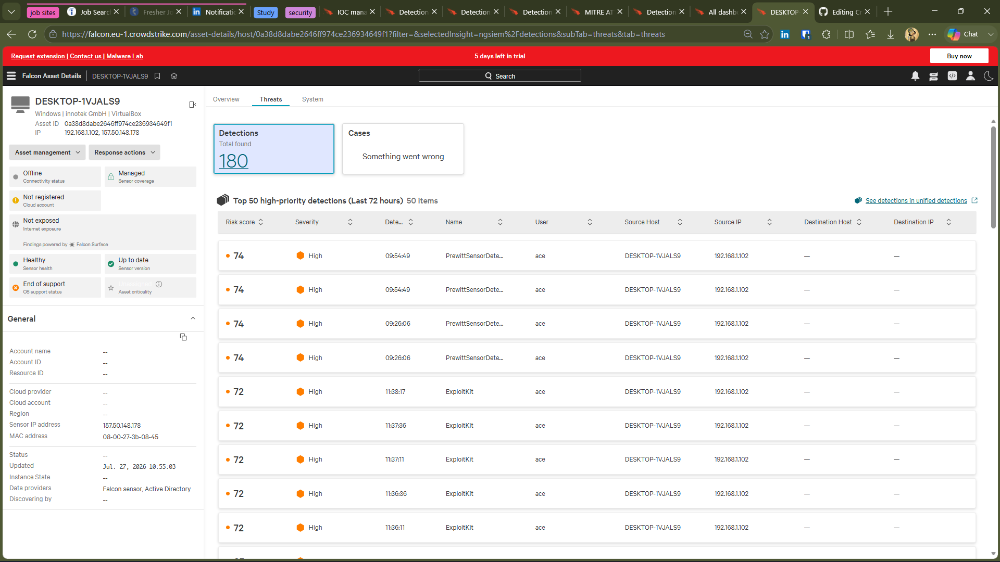
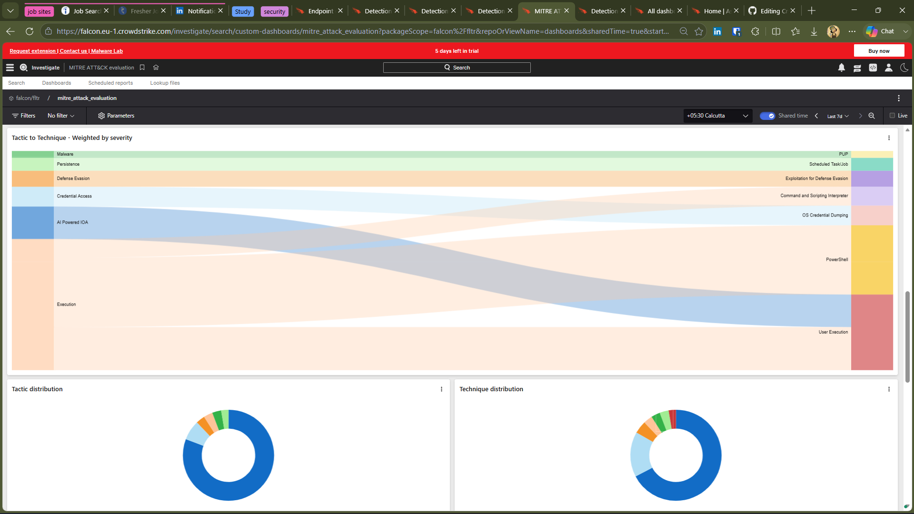
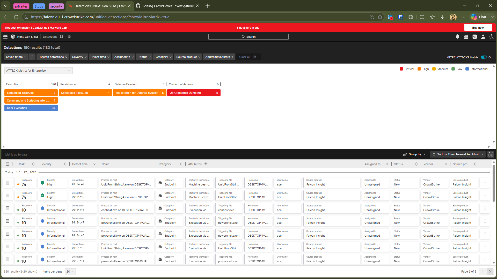
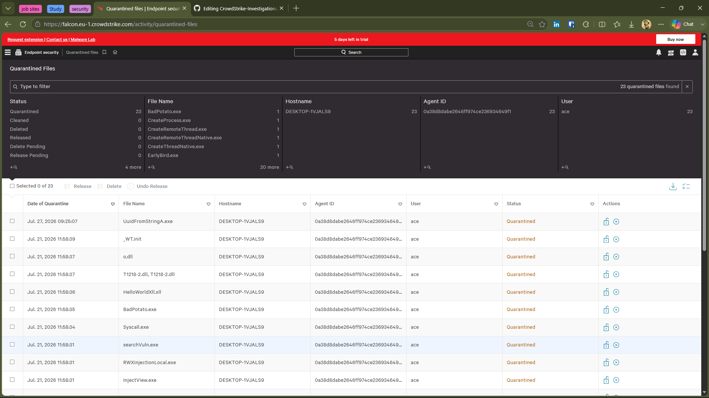

# 🛡️ CrowdStrike Falcon Investigation Portfolio

## 📖 About This Portfolio

This repository documents a series of end-to-end Endpoint Detection and Response (EDR) investigations performed using **CrowdStrike Falcon** within a controlled home SOC laboratory.

Rather than simply executing attack simulations, each investigation follows a structured SOC analyst workflow including detection validation, process analysis, MITRE ATT&CK mapping, incident classification, and professional incident documentation.

The objective of this portfolio is to demonstrate practical experience investigating endpoint detections using enterprise EDR tooling while applying real-world SOC investigation methodology.

## 🎯 Project Scope

This portfolio was created to:

- Validate CrowdStrike Falcon detections using controlled attack simulations.
- Practice endpoint investigation and incident triage.
- Analyze process execution, timelines, and detection artifacts.
- Map detections to the MITRE ATT&CK framework.
- Understand CrowdStrike Falcon's prevention and detection capabilities.
- Produce professional investigation reports following SOC analyst workflows.

---

# 🧠 Why CrowdStrike Falcon for This Project?

Selecting the right Endpoint Detection and Response (EDR) platform was a key decision when designing this project. The objective was not simply to generate alerts, but to investigate endpoint activity using an enterprise-grade platform that provides comprehensive visibility into attack behavior.

CrowdStrike Falcon was chosen because it combines cloud-native architecture, behavioral analytics, machine learning, and real-time prevention capabilities within a lightweight endpoint sensor. Rather than relying solely on known malware signatures, Falcon continuously monitors endpoint activity to detect suspicious behaviors associated with real-world attack techniques.

Throughout this project, CrowdStrike Falcon was used to:

- Monitor endpoint activity in real time.
- Detect behavioral indicators of compromise (IOAs).
- Correlate related security events into investigations.
- Automatically block or quarantine malicious activity.
- Map detections to the MITRE ATT&CK framework.
- Provide detailed investigation artifacts such as Process Graphs, Process Trees, and Event Timelines.

These capabilities enabled each investigation to follow a structured SOC analyst workflow from initial detection through incident analysis, classification, and documentation.

---

# ⚖️ Why EDR Instead of Traditional Antivirus?

Traditional antivirus solutions primarily focus on identifying known malicious files using signatures or reputation-based detection. While effective against many common threats, modern attacks frequently use legitimate system tools and techniques that leave few malicious files to detect.

Endpoint Detection and Response (EDR) platforms provide continuous visibility into endpoint activity by monitoring process execution, command-line activity, registry modifications, persistence mechanisms, network connections, and other behavioral indicators.

This project emphasizes behavioral investigation rather than signature-based detection, making an EDR platform the appropriate choice for validating attack techniques and documenting incident response workflows.

| Traditional Antivirus | CrowdStrike Falcon EDR |
|------------------------|------------------------|
| Primarily signature-based detection | Behavioral and machine learning detection |
| Detects known malicious files | Detects suspicious attack techniques and behaviors |
| Limited investigation context | Rich investigation artifacts and event correlation |
| Focuses on malware identification | Supports complete incident investigation and response |

---

# 🧪 Why Atomic Red Team for Detection Validation?

This project uses Atomic Red Team to safely simulate adversary techniques in a controlled lab environment. Each Atomic test is mapped to the MITRE ATT&CK framework, allowing security teams to validate detection capabilities against realistic attack behaviors without deploying actual malware.

Atomic Red Team provides small, repeatable tests that emulate specific ATT&CK techniques, making it well suited for evaluating endpoint detection and response (EDR) platforms.

For this project, Atomic Red Team was used to:

- Validate CrowdStrike Falcon behavioral detections.
- Generate realistic endpoint telemetry.
- Execute MITRE ATT&CK techniques in a controlled environment.
- Analyze Falcon's detection, prevention, and response capabilities.
- Produce repeatable investigations following SOC analyst workflows.

Using Atomic Red Team ensured that each investigation was based on documented adversary techniques while maintaining a safe testing environment.

---

# ❓ Why EICAR Wasn't the Primary Validation Method?

The EICAR test file is an industry-standard antivirus test file designed to verify signature-based malware detection without using actual malicious code.

During this project, EICAR was not used as the primary validation method because the objective was to evaluate CrowdStrike Falcon's Endpoint Detection and Response (EDR) capabilities rather than traditional signature-based antivirus detection.

Unlike conventional antivirus products that primarily rely on known file signatures, CrowdStrike Falcon emphasizes behavioral analysis by monitoring process execution, command-line activity, persistence mechanisms, registry modifications, and other Indicators of Attack (IOAs). This enables Falcon to identify suspicious behaviors associated with real-world attack techniques, even when no known malware signature is present.

In this lab environment, the EICAR test file did not generate the behavioral detections required for meaningful endpoint investigations. Instead, Atomic Red Team and controlled manual attack simulations were used to produce realistic telemetry, allowing each investigation to include process graphs, event timelines, MITRE ATT&CK mappings, and incident analysis representative of a real SOC workflow.

---

# 🖥️ Validation Environment

This project was conducted in a controlled lab environment to evaluate CrowdStrike Falcon's endpoint detection and response capabilities through safe and repeatable attack simulations.

The validation workflow focuses on generating realistic endpoint activity, analyzing CrowdStrike Falcon detections, and documenting each investigation using a structured SOC analyst methodology.

  

### Environment Summary

| Component | Purpose |
|-----------|---------|
| Atomic Red Team | Simulate MITRE ATT&CK techniques |
| Windows 10 Endpoint | Target system monitored by CrowdStrike Falcon |
| CrowdStrike Falcon Sensor | Collect endpoint telemetry and behavioral activity |
| CrowdStrike Falcon Cloud | Detection, prevention, event correlation, and investigation |
| SOC Investigation Workflow | Analyze detections, validate alerts, map MITRE techniques, and document findings |

> **Note:** All attack simulations were performed within an isolated lab environment for educational and defensive security purposes.

---

# 🖥️ CrowdStrike Falcon Platform Overview

CrowdStrike Falcon served as the primary Endpoint Detection and Response (EDR) platform throughout this project. Each investigation leveraged Falcon's cloud-native capabilities to detect, analyze, and respond to simulated attack techniques executed within the validation environment.

The following sections highlight the primary Falcon components used during the investigation process.

---

## Endpoint Management

The Endpoint Management dashboard provides centralized visibility into protected endpoints, sensor health, and overall detection activity. It serves as the starting point for identifying monitored assets and reviewing endpoint status.

  

---

## MITRE ATT&CK Evaluation

Falcon automatically maps detected behaviors to the MITRE ATT&CK framework, enabling analysts to understand attacker tactics and techniques while improving investigation accuracy.

  

---

## Unified Detections

The Unified Detections dashboard consolidates security alerts into a centralized investigation view, providing severity ratings, behavioral context, and detailed detection information for each event.

  

---

## Quarantined Files

Falcon automatically quarantines malicious files when prevention policies are triggered, helping contain threats while preserving investigation artifacts for further analysis.

  

---

# 📂 Investigation Catalog

This repository contains five endpoint investigations performed using CrowdStrike Falcon within a controlled validation environment. Each investigation follows a structured SOC analyst workflow, including detection validation, evidence collection, process analysis, MITRE ATT&CK mapping, incident classification, and professional documentation. Select an investigation below to explore the complete analysis, MITRE ATT&CK mapping, evidence, and analyst findings.

<strong>📁 View Investigation Portfolio (5 Investigations)</strong>

 

### 🔐 Investigation 01 – Credential Access (SAM Hive)

**MITRE ATT&CK:** T1003 – OS Credential Dumping  
**Status:** ✅ Closed

Investigated registry hive access associated with credential dumping techniques and analyzed CrowdStrike Falcon's behavioral detection.

➡️ **Repository:** [Investigation-01-Credential-Access-SAM-Hive](./Investigation-01-Credential-Access-SAM-Hive)

---

### 🤖 Investigation 02 – Atomic Red Team Git Clone

**MITRE ATT&CK:** Machine Learning Detection  
**Status:** ✅ Closed

Investigated machine learning detections generated during an Atomic Red Team repository clone and analyzed Falcon's response.

➡️ **Repository:** [Investigation-02-Atomic-Red-Team-Git-Clone](./Investigation-02-Atomic-Red-Team-Git-Clone)

---

### ⏰ Investigation 03 – Scheduled Task Persistence

**MITRE ATT&CK:** T1053 – Scheduled Task/Job  
**Status:** ✅ Closed

Investigated persistence through Windows Scheduled Tasks and validated Falcon's prevention capabilities.

➡️ **Repository:** [Investigation-03-Scheduled-Task-Persistence](./Investigation-03-Scheduled-Task-Persistence)

---

### 🌐 Investigation 04 – LOLBin Abuse Using MSHTA

**MITRE ATT&CK:** T1218.005 – MSHTA  
**Status:** ✅ Closed

Investigated malicious MSHTA execution across multiple attack scenarios and documented Falcon's behavioral detections.

➡️ **Repository:** [Investigation-04-LOLBin-Abuse-Using-MSHTA](./Investigation-04-LOLBin-Abuse-Using-MSHTA)

---

### 💉 Investigation 05 – Process Injection ML Detection

**MITRE ATT&CK:** T1055 – Process Injection  
**Status:** ✅ Closed

Investigated process injection using Atomic Red Team and analyzed CrowdStrike Falcon's cloud-based machine learning detection and prevention capabilities.

➡️ **Repository:** [Investigation-05-Process-Injection-ML-Detection](./Investigation-05-Process-Injection-ML-Detection)

---

## 📊 Portfolio Summary

- 🗂️ **Total Investigations:** 5
- 🎯 **MITRE ATT&CK Techniques:** 4
- 🤖 **Machine Learning Investigation:** 1
- 🛡️ **Endpoint Detection Platform:** CrowdStrike Falcon
- 🖥️ **Environment:** Controlled Validation Lab
- ✅ **Investigation Status:** 5 Closed Cases
---

# 📈 Detection Coverage

- **Credential Access** → **T1003** – OS Credential Dumping
- **Persistence** → **T1053** – Scheduled Task/Job
- **Defense Evasion** → **T1218.005** – MSHTA
- **Defense Evasion** → **T1055** – Process Injection
- **Machine Learning Detection** → Git Repository Clone (Behavioral ML Detection)
  
These investigations demonstrate CrowdStrike Falcon's ability to detect, prevent, and correlate adversary behaviors while providing analysts with comprehensive investigation artifacts, including process graphs, event timelines, and MITRE ATT&CK mappings.

---

# 🛠️ Skills Demonstrated

Throughout these investigations, the following cybersecurity skills were applied and reinforced:

- Endpoint Detection and Response (EDR) Investigation
- Incident Triage and Alert Validation
- Behavioral Analysis
- Process Tree and Process Graph Analysis
- MITRE ATT&CK Mapping
- Windows Endpoint Security
- Threat Detection and Analysis
- Atomic Red Team Attack Simulation
- Incident Documentation
- Security Report Writing

---

# 🎓 Key Learning Outcomes

This project provided practical experience in investigating endpoint detections using an enterprise-grade EDR platform. Beyond executing attack simulations, the focus was placed on understanding how security analysts validate alerts, analyze behavioral evidence, correlate attack activity, and document investigations following structured SOC workflows.

The investigations strengthened practical knowledge of endpoint telemetry, behavioral detection, MITRE ATT&CK mapping, and incident response methodology while demonstrating how CrowdStrike Falcon supports real-world security operations.

---

# 🔙 Explore More Projects

Interested in more cybersecurity projects?

Return to my main GitHub portfolio to explore additional investigations, home lab projects, SIEM implementations, and technical documentation.

➡️ **[Back to Main Portfolio](https://github.com/rohithbaggu56-dot)**
